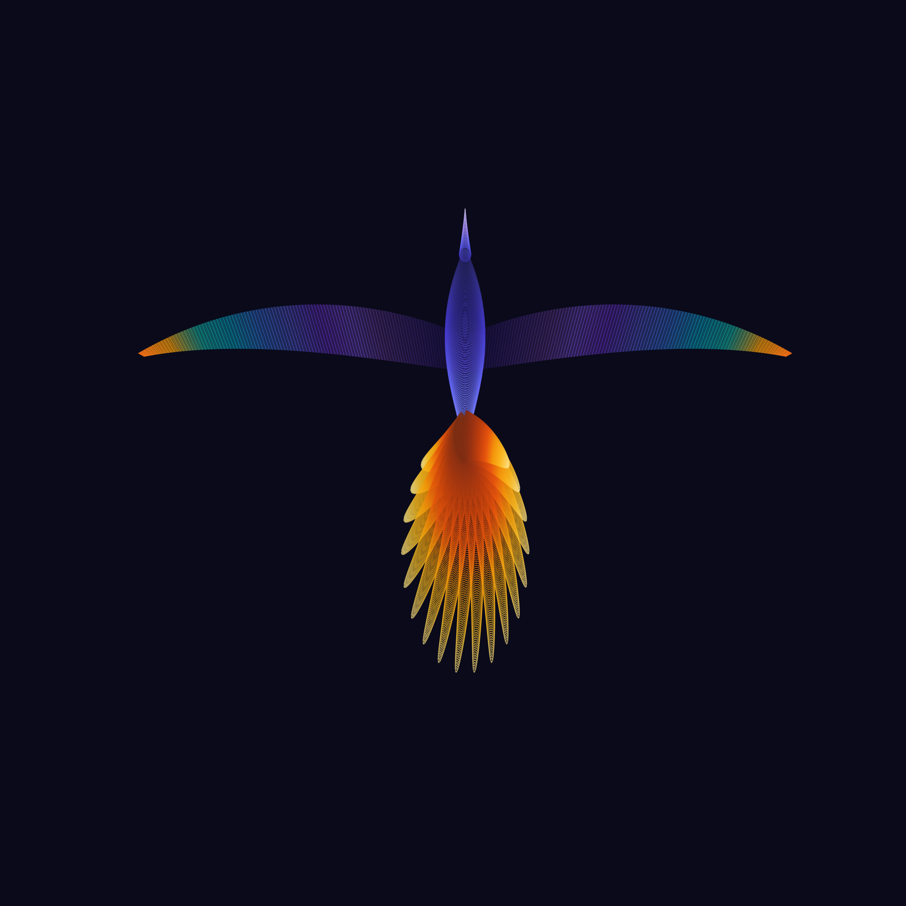
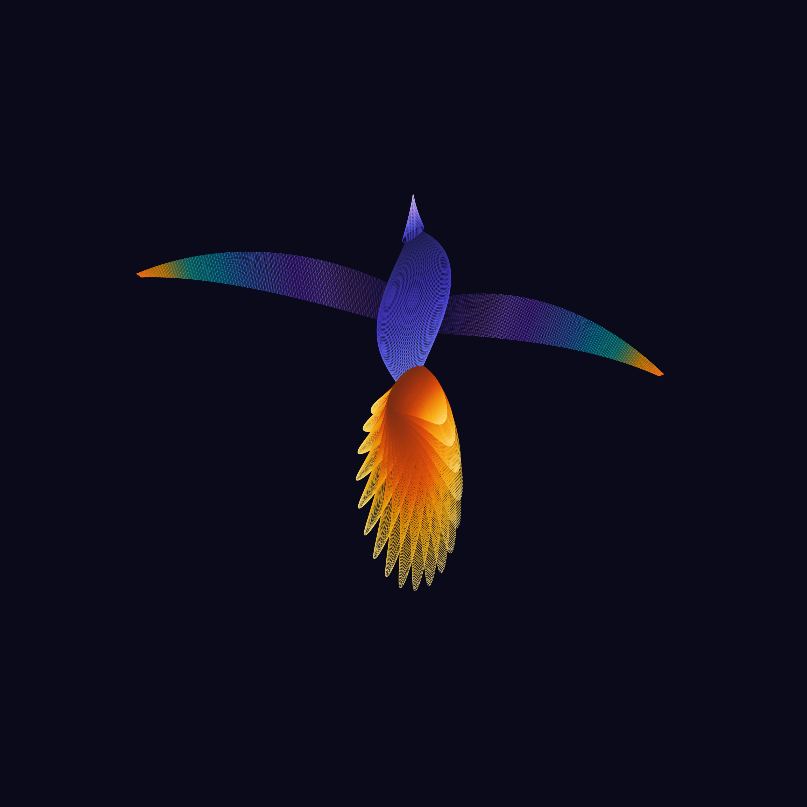
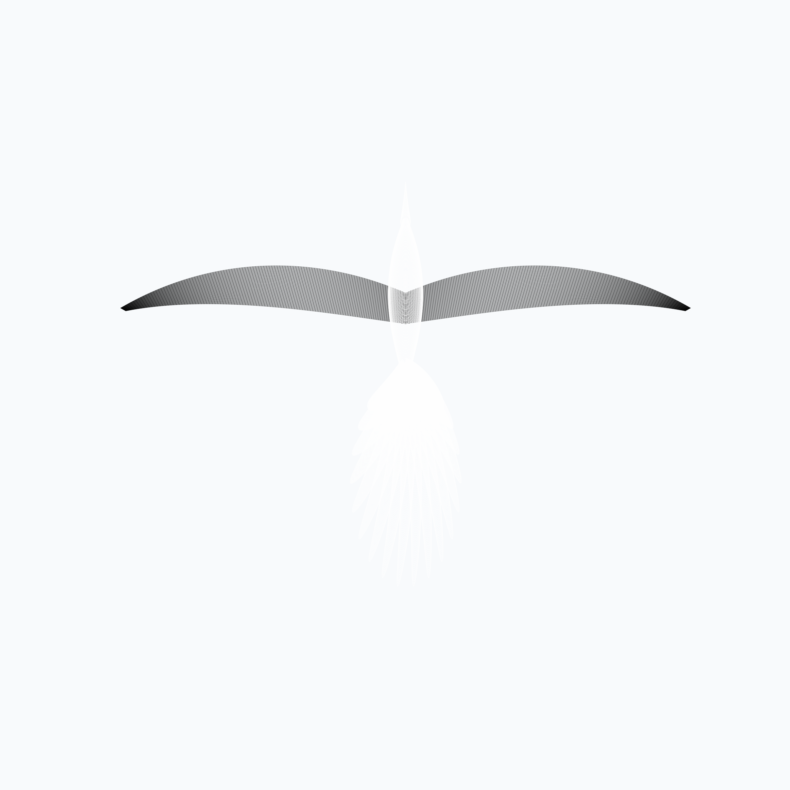

<p align="center">
  
</p>

<h1 align="center">🕊️ Bird From Math Equations</h1>

<p align="center">
  <em>A bird sculpted entirely from parametric equations — Bézier curves, ruled surfaces, and rotation-minimising frames.</em>
</p>

<p align="center">
  
  
  
  
</p>

---

## ✨ Gallery

<table>
  <tr>
    <td align="center"><strong>🌑 Hero Shot (Front View)</strong></td>
    <td align="center"><strong>🔄 Three-Quarter View</strong></td>
  </tr>
  <tr>
    <td></td>
    <td></td>
  </tr>
  <tr>
    <td align="center"><strong>🔝 Top-Down View</strong></td>
    <td align="center"><strong>📐 Classic Wireframe</strong></td>
  </tr>
  <tr>
    <td></td>
    <td></td>
  </tr>
</table>

---

## 🧮 The Math Behind the Bird

Every curve, surface, and feather in this bird is defined by **pure mathematics** — no freehand drawing, no image editing, no AI-generated art. Just equations.

### Master Surface Equation

The entire bird is assembled from **tube-swept parametric surfaces**. Every component curve $\vec{\gamma}(t)$ generates a surface by sweeping a circle of radius $r(t)$ perpendicular to the curve:

$$\vec{S}(t,\theta) = \vec{\gamma}(t) + r(t)\left[\hat{N}(t)\cos\theta + \hat{B}(t)\sin\theta\right]$$

where $\hat{N}(t)$ and $\hat{B}(t)$ are the normal and binormal vectors of the **Rotation-Minimising Frame** (Bishop frame).

### Bézier Curves

All spine curves are constructed from **cubic** and **quadratic Bézier curves**:

$$\vec{B}_3(t) = (1-t)^3\vec{P}_0 + 3(1-t)^2t\,\vec{P}_1 + 3(1-t)t^2\vec{P}_2 + t^3\vec{P}_3$$

$$\vec{B}_2(t) = (1-t)^2\vec{P}_0 + 2(1-t)t\,\vec{P}_1 + t^2\vec{P}_2$$

### Wing Surface (Ruled Surface)

Each wing is a **bilinear ruled surface** stretched between a leading-edge curve $\vec{\alpha}(u)$ and a trailing-edge curve $\vec{\beta}(u)$:

$$\vec{S}_{\text{wing}}(u,v) = (1-v)\,\vec{\alpha}(u) + v\,\vec{\beta}(u), \qquad u,v \in [0,1]$$

### Body Radius Profile

$$r_{\text{body}}(t) = R_0 + A\sin^{\alpha}(\pi\,t)$$

### Tail Feather Fan

$M$ tail feathers fan out with azimuth angles and bell-curve lengths:

$$\phi_j = \phi_{\min} + \frac{j}{M-1}(\phi_{\max} - \phi_{\min}), \qquad L_j = L_{\text{side}} + (L_{\text{mid}} - L_{\text{side}})\sin\!\left(\frac{\pi j}{M-1}\right)$$

> 📄 See [`bird_equations.pdf`](bird_equations.pdf) for the **complete mathematical formulation** with all control points, parameters, and derivations.

---

## 🚀 Quick Start

```bash
# Clone the repository
git clone https://github.com/satyajitpuhan/beautiful.git
cd beautiful

# Install dependencies
pip install numpy matplotlib

# Generate all bird renders
python bird.py
```

This will output **4 high-resolution renders**:

| File | Description |
|------|-------------|
| `mathematical_bird.png` | Hero shot — dark mode, front view |
| `bird_three_quarter.png` | Three-quarter perspective view |
| `bird_top_view.png` | Top-down aerial view |
| `bird_wireframe_classic.png` | Classic black-on-white wireframe |

---

## 📁 Project Structure

```
beautiful/
├── bird.py                  # Python renderer (parametric surface engine)
├── bird_equations.tex       # Full LaTeX documentation of all equations
├── bird_equations.pdf       # Compiled PDF of mathematical formulation
├── mathematical_bird.png    # Hero render (dark, gradient colors)
├── bird_three_quarter.png   # 3/4 perspective view
├── bird_top_view.png        # Top-down view
├── bird_wireframe_classic.png  # Classic wireframe render
└── README.md
```

---

## 🎨 Visual Features

- **Gradient coloring** — wings transition from deep indigo through electric violet to golden amber at the tips
- **Glow effects** — subtle luminous halos around every curve on dark backgrounds
- **Multi-view renders** — front, three-quarter, top-down, and classic wireframe
- **Dark mode** — deep blue-black backgrounds that make the math glow
- **350 DPI output** — crisp, publication-quality renders

---

## 🔬 Components

| Component | Equation Type | Parameters |
|-----------|--------------|------------|
| **Wings** | Ruled surface (bilinear) | 8 Bézier control points per wing |
| **Body** | Swept tube (RMF) | Cubic Bézier spine + sine-power radius |
| **Head** | Tapered cone | Linear spine + power-law radius |
| **Tail** | Fan of swept tubes | 18 quadratic Bézier feathers |
| **Symmetry** | Reflection matrix | $\text{diag}(-1, 1, 1)$ |

---

## 📜 License

This project is open source. Feel free to use, modify, and share.

---

<p align="center">
  <strong>Every pixel is a point on a parametric surface. Every curve is a Bézier polynomial. Every feather is an equation.</strong>
</p>

<p align="center">
  <em>Made with 🧮 by <a href="https://github.com/satyajitpuhan">Satyajit Puhan</a></em>
</p>
